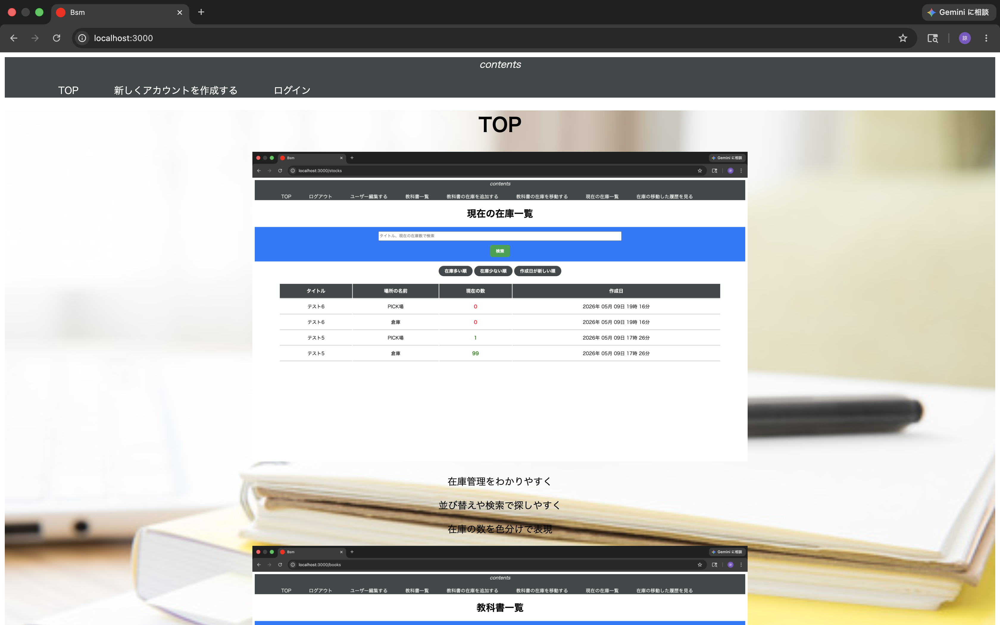
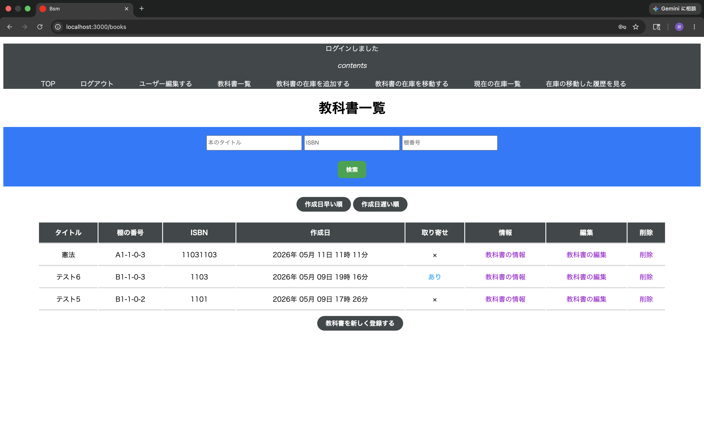
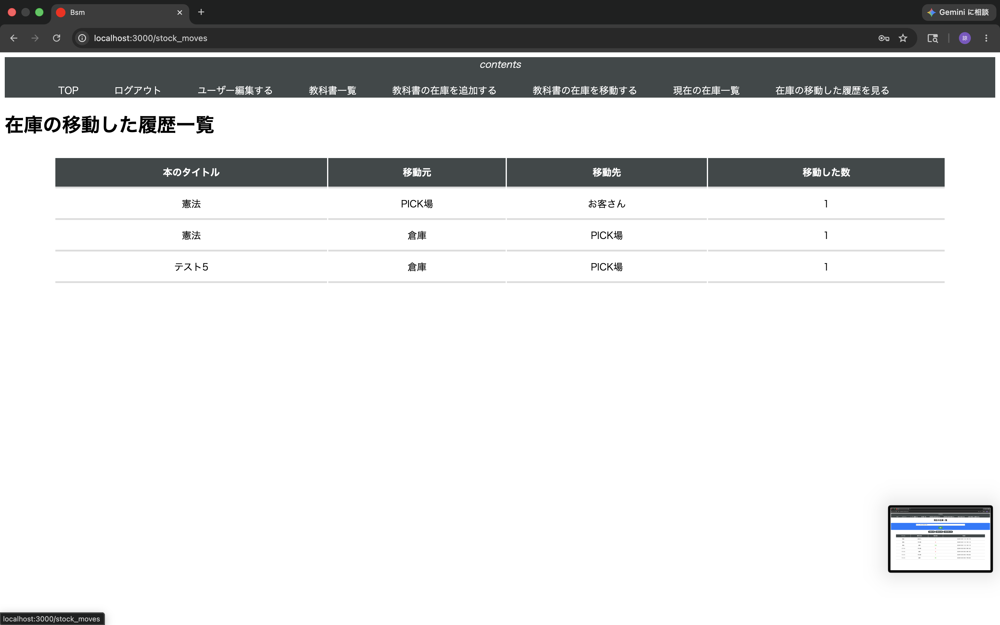
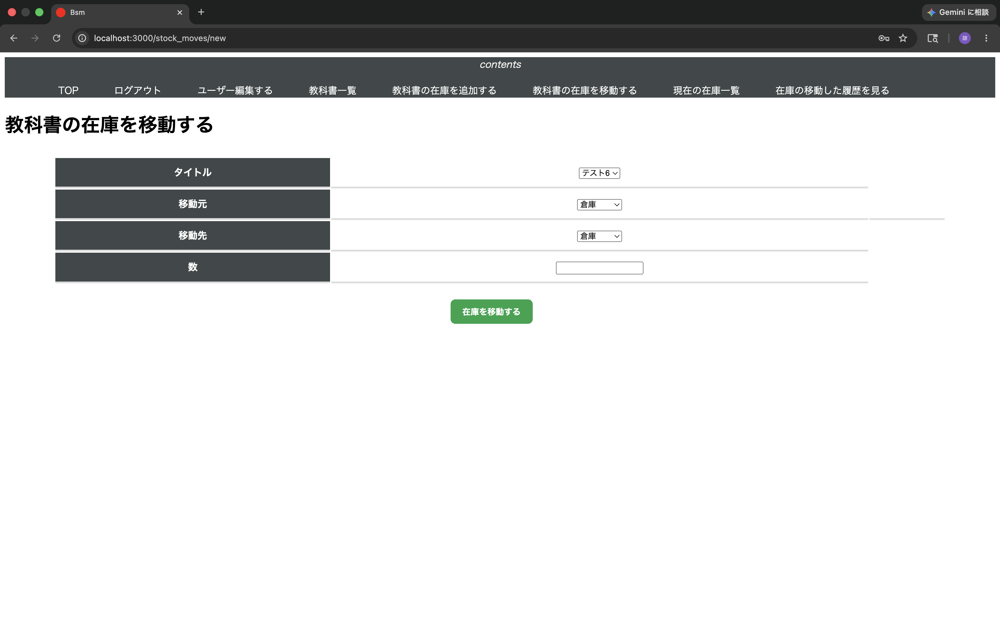
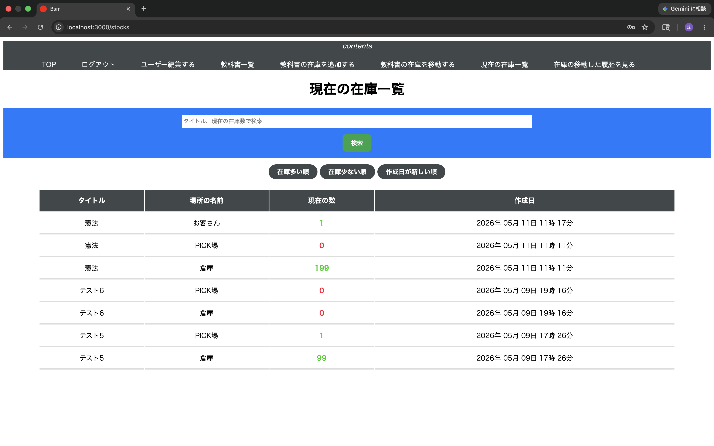

# ポートフォリオの概要
Ruby on Railsを用いて開発した在庫移動管理アプリです。

# できること
倉庫・Pick場・お客様間での在庫数や在庫移動を一元管理できるように設計しました。
ログイン画面で在庫移動アプリに遷移、教科書のCRUD、在庫の数を登録ができること、場所ごとに在庫の数を移動できること、現在の在庫一覧で場所ごとの数を管理することができます。

# 使用したgem
devise→ユーザー認証機能の実装に使用
 
pg→herokuのDBを使用するためPostgreSQLを使用
 
rails-i18n→わかりやすくなるようにRailsの日本語化対応に使用

# 紹介画像

# ER図

```mermaid
erDiagram
USERS {
  bigint id PK
  string email
  string encrypted_password
  string reset_password_token
  datetime reset_password_sent_at
  datetime remember_created_at
  datetime created_at
  datetime updated_at
}

BOOKS {
    bigint id PK
    string title
    integer book_quantity
    string rack_number
    string isbn
    datetime reservation_date
    datetime order_date
    datetime order_date_time
    datetime special_order_date_time
    text note
    datetime created_at
    datetime updated_at
}

LOCATIONS {
  bigint id PK
  string name
  integer kind
  string code
  datetime created_at
  datetime updated_at
}

STOCK_MOVES {
  bigint id PK
  bigint book_id FK
  bigint from_location_id FK
  bigint to_location_id FK
  integer quantity
  string move_type
  datetime created_at
  datetime updated_at
}

STOCKS {
    bigint id PK
    bigint book_id FK
    bigint location_id FK
    integer quantity
    datetime created_at
    datetime updated_at
}

BOOKS ||--o{ STOCKS : has
LOCATIONS ||--o{ STOCKS : stores
BOOKS ||--o{ STOCK_MOVES : moves
LOCATIONS ||--o{ STOCK_MOVES : from_location
LOCATIONS ||--o{ STOCK_MOVES : to_location
```

# このポートフォリオを作成した理由
アルバイトでピッキング作業を行っていた際、商品の補充時に在庫数が正確に把握できず、作業効率が下がる場面がありました。
在庫の数が明確であれば、補充判断がスムーズになると感じ、この課題を解決するために作成しました。

# 使用技術
Ruby on Rails 8.0.5
PostgreSQL
HTML,CSS
devise
GitHub
CircleCI
Docker
Heroku

# 力を入れた点
現場で働く店長にヒアリングを行い、在庫数の見やすさを改善した点に力を入れました。
会話を重ねる中で、「必要な在庫をすぐに見つけたい」という課題があると分かり、検索機能や並び替え機能を追加しました。

# 難しかった点・苦労した点
在庫移動時の在庫数管理に苦労しました。
複数のロケーション間で在庫を移動するため、移動元と移動先の在庫数が崩れないように進めました。
また、ヒアリングを進める中で、初期の画面構成と違う部分もあり試行錯誤しながら改善しました。

# なぜruby on railsで作ろうとしたのか
機能ごとに役割を整理しやすい点に魅力を感じ、Ruby on Railsを選択しました。
在庫管理アプリでは、商品・在庫・ロケーション・在庫移動など複数のデータの役割を考える必要があります。データが混じらないように設計できるため、業務システムとの相性が良いと考えました。
検索機能や色分けを追加したいと考えUIの柔軟性が高いrailsにしました。

# 今後の改善点
今後はデータ件数が増えた場合でも安定して動作するシステムに改善していきたいと考えています。
特に、在庫データが3000件以上になった際にも快適に利用できるよう、機能改善に取り組みたいと考えています。
DBのインデックス設計やページネーションの導入、不要なクエリを削減することで、処理速度の向上を目指しています。
また、今後はバーコード機能を追加して現場でも使いやすく改善していきたいと考えています。

# テスト用のメールアドレス:test@example.com
# テスト用のパスワード:password
