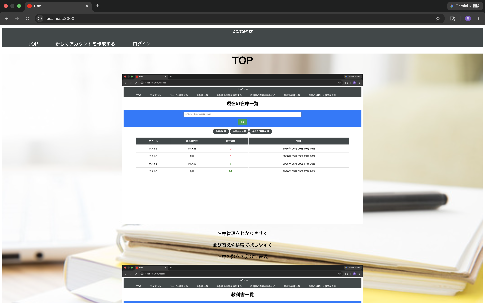
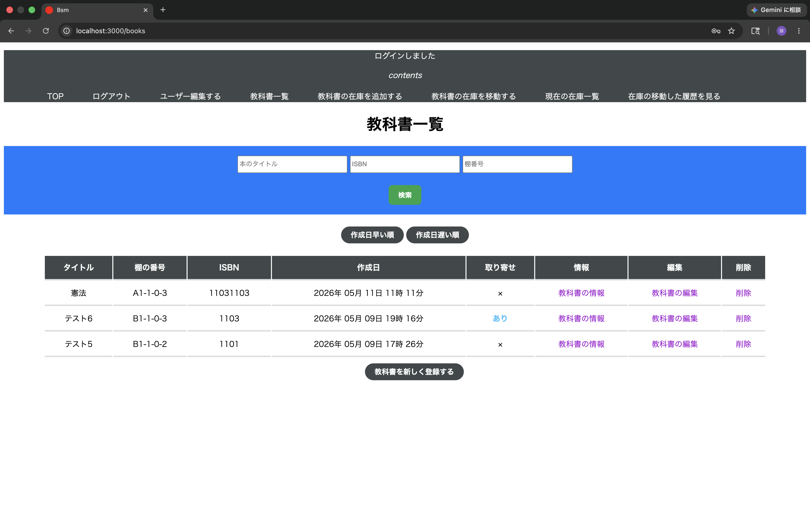
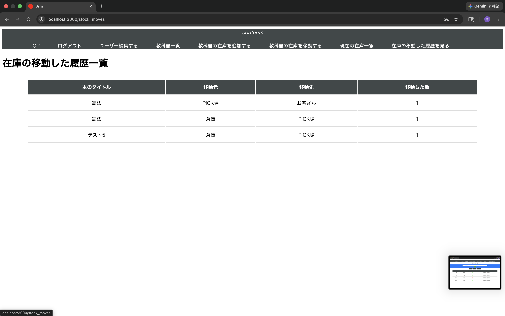
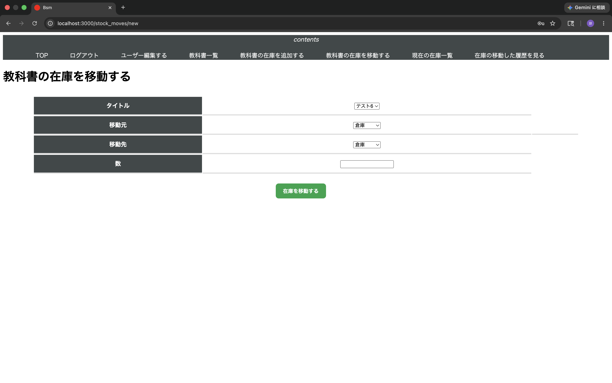
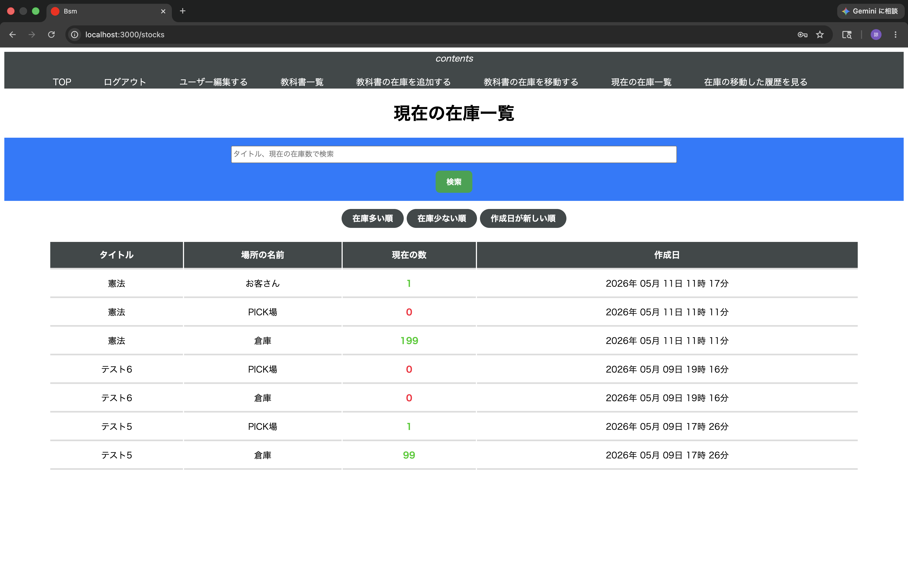
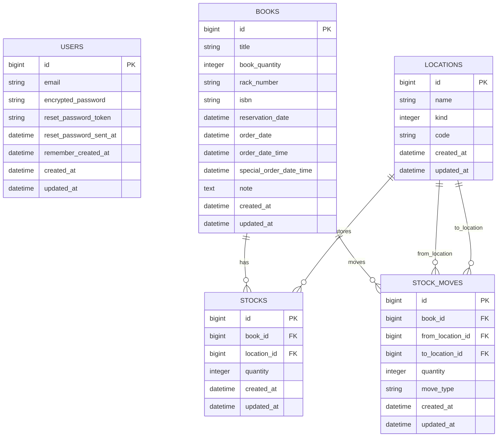

## テスト用アカウント
以下のアカウントでログインできます。
- メールアドレス：test@example.com  
- パスワード：password

# ポートフォリオの概要
アルバイト業務において、在庫数や保管場所の把握が曖昧で、
補充判断の遅れや作業効率の低下が課題となっていました。
この課題を解決するため、在庫の移動と数量を一元管理できる
在庫移動管理アプリを開発しました。

## できること
- 倉庫・Pick場・顧客間の在庫数を一元管理
- 在庫情報の登録・編集・削除（CRUD機能）
- ロケーション間の在庫移動機能
- 現在の在庫状況を一覧で確認（場所ごとに可視化）
- ユーザー認証機能（ログイン・ログアウト）
- バーコード（ISBN）による教科書情報の自動取得

# このポートフォリオを作成した理由
アルバイトでのピッキング作業において、
在庫数の把握が不正確であり、補充判断の遅れや作業効率の低下が課題となっていました。
この課題を解決するため、在庫の状況を正確に管理し、
補充判断を迅速に行えるようにすることを目的として
在庫移動管理アプリを開発しました。

# 力を入れた点
現場で働く店長にヒアリングを行い、
在庫数の把握と検索性に課題があることを特定しました。
その結果、「必要な在庫をすぐに見つけたい」というニーズが明確になったため、
検索機能および並び替え機能を実装し、在庫の視認性と操作性の改善に取り組みました。

## 難しかった点・苦労した点
在庫移動機能の実装において、移動元と移動先の在庫数の整合性を保つ点が最も難しい課題でした。
複数のロケーション間で在庫が移動するため、
更新処理の順序やデータの整合性を意識しながら設計・実装を行いました。
また、ヒアリングを進める中で業務要件が変化し、
初期の画面設計では対応できない部分が出てきたため、
設計と実装を繰り返し改善しながら対応しました。

## なぜRuby on Railsを使用したか
機能ごとに役割を整理しやすく、MVC構造により
データと表示の責務を分離できる点に魅力を感じたためです。
在庫管理アプリでは、商品・在庫・ロケーション・在庫移動など
複数のデータ間の関係を正しく設計する必要があり、
構造的に整理しやすいRailsは業務システム開発に適していると考えました。
また、CRUD機能の開発効率が高く、
短期間で仕様変更にも対応しやすい点から採用しました。

## 使用技術
- Ruby on Rails 8.0.5（アプリケーション開発）
- PostgreSQL（データベース管理）
- HTML / CSS（画面構築）
- devise（ユーザー認証機能）
- Docker（開発環境の統一）
- Heroku（デプロイ環境）
- GitHub（ソース管理）
- CircleCI（CI/CDによる自動テスト）
- TypeScript（ISBN読み取り画面の構築）
- html5-qrcode（QRコードのスキャン）
- Google Books API（本の情報を連携）
- rspec（本当に動くかテストを実装）

## 今後の改善点
在庫データが増加した場合でも安定して動作するシステムを目指しています。
ヒアリングでは、3,000件以上のデータを扱う可能性があることが分かり、
パフォーマンス改善の重要性を認識しました。

そのため、以下の改善を予定しています。
- インデックス設計の最適化による検索速度の向上
- N+1問題の改善によるデータ取得の最適化
また、現場での作業効率向上のため、
データを探しやすくするためカテゴリ機能の追加も検討しています。

## 使用したGem
- devise  
  ユーザー認証機能（ログイン・ログアウト・セッション管理）を実装するため使用
- pg  
  本番環境（Heroku）でPostgreSQLを利用するため導入
- rails-i18n  
  バリデーションメッセージや表示を日本語化し、ユーザーの可読性を向上させるため使用
- Kaminari  
  データの膨大性により見た目が崩れないように使用
- rails-i18n  
  見やすくするため日本語で使用

# 紹介画像

# ER図

```mermaid
erDiagram
USERS {
  bigint id PK
  string email
  string encrypted_password
  string reset_password_token
  datetime reset_password_sent_at
  datetime remember_created_at
  datetime created_at
  datetime updated_at
}

BOOKS {
    bigint id PK
    string title
    integer book_quantity
    string rack_number
    string isbn
    datetime reservation_date
    datetime order_date
    datetime order_date_time
    datetime special_order_date_time
    text note
    datetime created_at
    datetime updated_at
}

LOCATIONS {
  bigint id PK
  string name
  integer kind
  string code
  datetime created_at
  datetime updated_at
}

STOCK_MOVES {
  bigint id PK
  bigint book_id FK
  bigint from_location_id FK
  bigint to_location_id FK
  integer quantity
  string move_type
  datetime created_at
  datetime updated_at
}

STOCKS {
    bigint id PK
    bigint book_id FK
    bigint location_id FK
    integer quantity
    datetime created_at
    datetime updated_at
}

BOOKS ||--o{ STOCKS : has
LOCATIONS ||--o{ STOCKS : stores
BOOKS ||--o{ STOCK_MOVES : moves
LOCATIONS ||--o{ STOCK_MOVES : from_location
LOCATIONS ||--o{ STOCK_MOVES : to_location
```
